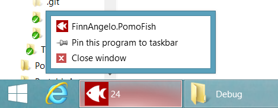

FinnAngelo.PomoFish
===================

Pomofish is a simple pomodoro timer that locks your PC at the end of 25 minutes

This is a `Minimum-Viable-Product`, and it is surprisingly useful.  
I'm using it _right now!_

----------------------
The Pomodoro Technique
----------------------

If you don't know the [Pomodoro technique](http://pomodorotechnique.com/), here is the tl:dr version:

* Focus 100% on something for 25 minutes - a **Pomo**
    * Write down any distractions/interruptions/vague brain wanderings as they occur and [keep on swimming](https://www.youtube.com/watch?v=0Hkn-LSh7es)
* Disengage for the next 5-10 minutes - a **Rest**
    * plan your next 25 minutes
    * or chase up the interruptions
    * or have a cup of tea, whatever
    * Just _stop. your. brain._

--------
Features
--------

01. It counts down 25 minutes
02. It shows how many minutes to go, and if less than a minute it shows how many seconds to go
    * It shows these minutes/seconds in the taskbar when minimised, which is useful.
03. It locks Windows (as per `#L`) at the end of 25 minutes
04. And then it closes
05. Yes. It is that simple.
06. **It has a pretty ICON**
    * It surprised me how much more useable it is with the pretty icon

----------
How to use
----------

01. Copy the `Pomofish.exe` and the `Pomofish.exe.config` files to a folder
02. Run `Pomofish.exe`, right-click and pin it to your taskbar
    
03. You now have 25 minutes until your PC locks
04. When your PC locks... go have a cup of tea. Or plan your next pomo, whatever
05. After 5-10 minutes, start a new Pomo using your new taskbar link

-------------
Other rubbish
-------------

* I used to have _lots_ more code for this. Check the GitHub history
* But now it is stripped back to the absolute minimum to pass the MS analysis tools
* Hmm... this really needs some sort of installer
    * Just something to pin it to the start bar
* And a website and an executable rather than just source code and... more!!!

-------
Credits
-------

Links to helpful folks:

* [Pomodoro technique](http://pomodorotechnique.com/)
* [Fish](https://thenounproject.com/term/fish/35592/) by Mister Pixel from the Noun Project
* [Inkscape Portable]()
* [IConvert Icons](https://iconverticons.com/online/)

And if you like my Pomofish, go be nice to someone like your mum or your neighbour. Pay it forward.
